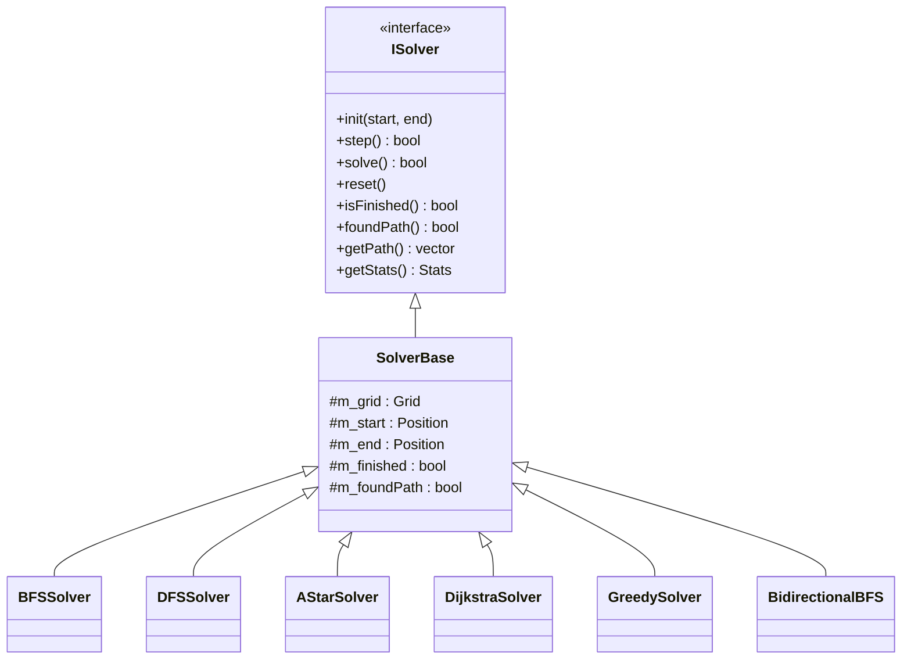
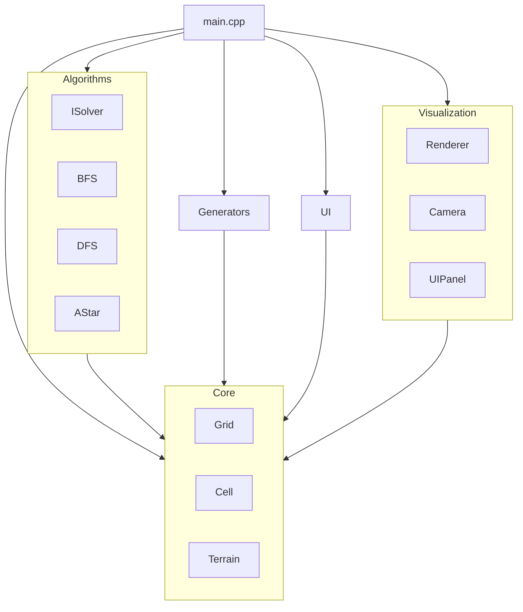
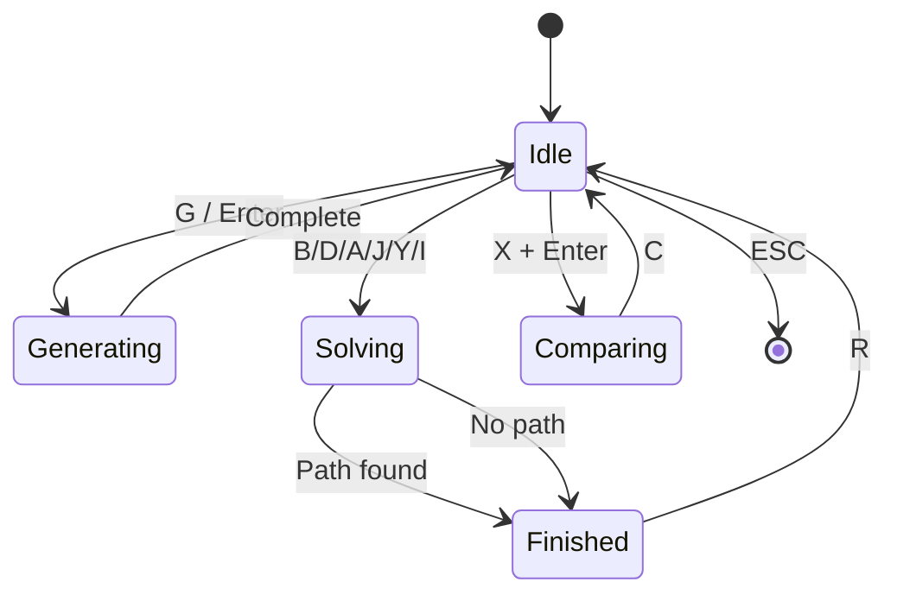

# 🧭 Labirent Visualizer - Detaylı Proje Dokümantasyonu
# 🧭 Labirent Visualizer - Detailed Project Documentation

---

## 📋 İçindekiler / Table of Contents

1. [Proje Genel Bakış / Project Overview](#-proje-genel-bakış--project-overview)
2. [Kurulum ve Derleme / Installation & Build](#-kurulum-ve-derleme--installation--build)
3. [Proje Dosya Yapısı / Project Structure](#-proje-dosya-yapısı--project-structure)
4. [Tuş Kısayolları / Keyboard Shortcuts](#-tuş-kısayolları--keyboard-shortcuts)
5. [Modüller ve Sınıflar / Modules & Classes](#-modüller-ve-sınıflar--modules--classes)
6. [Algoritmalar / Algorithms](#-algoritmalar--algorithms)
7. [UML Diyagramları / UML Diagrams](#-uml-diyagramları--uml-diagrams)
8. [Gelecek Geliştirmeler / Future Development](#-gelecek-geliştirmeler--future-development)
9. [Bilinen Sorunlar / Known Issues](#-bilinen-sorunlar--known-issues)
10. [Katkıda Bulunma / Contributing](#-katkıda-bulunma--contributing)

---

## 🎯 Proje Genel Bakış / Project Overview

**Labirent Visualizer**, labirent oluşturma ve yol bulma algoritmalarını görselleştiren interaktif bir C++ uygulamasıdır.

**Labirent Visualizer** is an interactive C++ application that visualizes maze generation and pathfinding algorithms.

### Özellikler / Features

| Özellik / Feature | Açıklama / Description |
|---|---|
| 🏗️ Maze Generation | 5 farklı algoritma ile labirent oluşturma |
| 🔍 Pathfinding | 6 farklı yol bulma algoritması |
| 🎨 Visualization | Animasyonlu adım adım görselleştirme |
| ⚖️ Comparison Mode | Algoritmaları yan yana karşılaştırma |
| 🗺️ Terrain System | Farklı arazi tipleri ve maliyetleri |
| 📊 Statistics | Gerçek zamanlı istatistikler |

### Teknolojiler / Technologies

- **Dil / Language:** C++23
- **Grafik / Graphics:** SFML 3.0
- **Build System:** CMake 3.16+
- **Platform:** macOS, Linux, Windows

---

## 🔧 Kurulum ve Derleme / Installation & Build

### Gereksinimler / Requirements

```bash
# macOS
brew install cmake sfml

# Ubuntu/Debian
sudo apt install cmake libsfml-dev

# Windows (vcpkg)
vcpkg install sfml
```

### Derleme Adımları / Build Steps

```bash
# Projeyi klonla / Clone the project
git clone https://github.com/yourusername/Labirent.git
cd Labirent

# Build dizini oluştur / Create build directory
mkdir build && cd build

# CMake yapılandır / Configure CMake
cmake ..

# Derle / Build
cmake --build . -j8

# Çalıştır / Run
./bin/LabirentVisualizer
```

### CMake Seçenekleri / CMake Options

| Option | Default | Description |
|--------|---------|-------------|
| `CMAKE_BUILD_TYPE` | `Release` | `Debug` veya `Release` |
| `BUILD_TESTS` | `OFF` | Testleri derle |

---

## 📁 Proje Dosya Yapısı / Project Structure

```
Labirent/
├── CMakeLists.txt              # Ana CMake yapılandırması
├── README.md                   # Temel readme
├── README_DETAILED.md          # Bu dosya
├── .gitignore                  # Git ignore kuralları
│
├── src/                        # Kaynak kodlar
│   ├── main.cpp               # Ana giriş noktası (~1000 satır)
│   │
│   ├── Core/                  # Çekirdek veri yapıları
│   │   ├── Cell.hpp          # Hücre bayrakları ve tipler
│   │   ├── Grid.hpp/cpp      # Ana grid veri yapısı
│   │   ├── Maze.hpp/cpp      # Labirent yardımcı sınıf
│   │   ├── Terrain.hpp       # Arazi tipleri
│   │   ├── DifficultySettings.hpp  # Zorluk ayarları
│   │   └── SeedManager.hpp   # Random seed yönetimi
│   │
│   ├── Generators/           # Labirent oluşturucular
│   │   ├── IMazeGenerator.hpp    # Jeneratör interface
│   │   ├── PrimGenerator.hpp/cpp
│   │   ├── KruskalGenerator.hpp/cpp
│   │   ├── BinaryTreeGenerator.hpp/cpp
│   │   └── EllersGenerator.hpp/cpp
│   │
│   ├── Algorithms/           # Yol bulma algoritmaları
│   │   ├── ISolver.hpp       # Solver interface
│   │   ├── BFSSolver.hpp/cpp
│   │   ├── DFSSolver.hpp/cpp
│   │   ├── AStarSolver.hpp/cpp
│   │   ├── DijkstraSolver.hpp/cpp
│   │   ├── GreedySolver.hpp/cpp
│   │   └── BidirectionalBFS.hpp/cpp
│   │
│   ├── Visualization/        # Görselleştirme
│   │   ├── Renderer.hpp/cpp  # Ana render engine
│   │   ├── Camera.hpp/cpp    # Kamera kontrolü
│   │   ├── UIPanel.hpp/cpp   # Sol panel (STATUS, CONTROLS)
│   │   └── Theme.hpp         # Renk teması
│   │
│   └── UI/                   # Kullanıcı arayüzü
│       ├── MenuSystem.hpp/cpp    # M tuşu menüsü
│       └── ComparisonView.hpp/cpp # Karşılaştırma modu
│
└── build/                    # Derleme çıktıları
    └── bin/
        └── LabirentVisualizer
```

---

## ⌨️ Tuş Kısayolları / Keyboard Shortcuts

### Labirent Oluşturma / Maze Generation

| Tuş / Key | İşlev / Function | Açıklama / Description |
|-----------|------------------|------------------------|
| `G` | Generate (Animated) | Animasyonlu labirent oluştur |
| `Enter` | Generate (Instant) | Anında labirent oluştur |
| `Shift+1` | Recursive Backtracking | Derin, uzun koridorlu labirent |
| `Shift+2` | Prim's Algorithm | Rastgele genişleyen labirent |
| `Shift+3` | Kruskal's Algorithm | Rastgele duvar kaldırma |
| `Shift+4` | Binary Tree | Hızlı, yönlü labirent |
| `Shift+5` | Eller's Algorithm | Satır satır oluşturma |

### Yol Bulma / Pathfinding

| Tuş / Key | Algoritma | Özellik |
|-----------|-----------|---------|
| `B` | BFS (Breadth-First) | En kısa yol garantisi |
| `D` | DFS (Depth-First) | Derin arama |
| `A` | A* (A-Star) | Heuristic optimizasyon |
| `J` | Dijkstra | Ağırlıklı en kısa yol |
| `Y` | Greedy Best-First | Hızlı, optimal değil |
| `I` | Bidirectional BFS | İki yönlü arama |

### Karşılaştırma Modu / Comparison Mode

| Tuş / Key | İşlev / Function |
|-----------|------------------|
| `X` | Karşılaştırma menüsünü aç/kapat |
| `2` / `4` | 2 veya 4 algoritma seç |
| `↑` / `↓` | Slot seç |
| `←` / `→` | Algoritma değiştir |
| `Enter` | Karşılaştırmayı başlat |
| `R` | Sıfırla ve yeniden başlat |
| `C` | Tamamen temizle |

### Kontroller / Controls

| Tuş / Key | İşlev / Function |
|-----------|------------------|
| `Space` | Animasyonu durdur/başlat |
| `+` / `-` | Animasyon hızını ayarla |
| `1` / `2` / `3` | Grid boyutu: 25, 100, 500 |
| `T` | Terrain modunu aç/kapat |
| `M` | Ayarlar menüsünü aç |
| `H` | Yardım panelini gizle/göster |
| `F` | Pencereye sığdır |
| `WASD` | Kamerayı kaydır |
| `Scroll` | Yakınlaştır/Uzaklaştır |
| `R` | Çözümü sıfırla |
| `C` | Her şeyi temizle |
| `ESC` | Çıkış |

---

## 🏗️ Modüller ve Sınıflar / Modules & Classes

### Core Modülü

#### `Grid` Sınıfı
```cpp
class Grid {
public:
    Grid(int width, int height);
    
    // Hücre erişimi / Cell access
    uint8_t getCell(int x, int y) const;
    void setCell(int x, int y, uint8_t flags);
    
    // Bayrak işlemleri / Flag operations
    void setFlag(Position pos, CellFlags flag);
    void clearFlag(Position pos, CellFlags flag);
    bool hasFlag(Position pos, CellFlags flag) const;
    
    // Duvar işlemleri / Wall operations
    void removeWall(Position from, Position to);
    bool hasWallBetween(Position a, Position b) const;
    
    // Arazi / Terrain
    void setTerrain(int x, int y, TerrainType type);
    TerrainType getTerrain(int x, int y) const;
    int getTerrainCost(int x, int y) const;
    
    // Başlangıç/Bitiş / Start/End
    void setStart(Position pos);
    void setEnd(Position pos);
    Position getStart() const;
    Position getEnd() const;
    
private:
    std::vector<uint8_t> m_cells;
    std::vector<TerrainType> m_terrain;
    int m_width, m_height;
};
```

#### `CellFlags` Enum
```cpp
enum class CellFlags : uint8_t {
    WallNorth = 0x01,  // Kuzey duvar
    WallSouth = 0x02,  // Güney duvar
    WallEast  = 0x04,  // Doğu duvar
    WallWest  = 0x08,  // Batı duvar
    Visited   = 0x10,  // Ziyaret edildi
    InPath    = 0x20,  // Yol üzerinde
    Current   = 0x40,  // Şu anki pozisyon
};
```

#### `TerrainType` Enum
```cpp
enum class TerrainType : uint8_t {
    Normal,   // Maliyet: 1
    Grass,    // Maliyet: 2
    Water,    // Maliyet: 5
    Mountain, // Maliyet: 10
    Lava,     // Geçilemez
};
```

---

### Algorithms Modülü

#### `ISolver` Interface
```cpp
class ISolver {
public:
    virtual void init(const Position& start, const Position& end) = 0;
    virtual bool step() = 0;       // Bir adım at
    virtual bool solve() = 0;      // Tamamını çöz
    virtual void reset() = 0;      // Sıfırla
    virtual bool isFinished() const = 0;
    virtual bool foundPath() const = 0;
    virtual const std::vector<Position>& getPath() const = 0;
    virtual const std::vector<Position>& getVisited() const = 0;
    virtual Position getCurrentPosition() const = 0;
    
    struct Stats {
        size_t nodesVisited;
        size_t pathLength;
        double elapsedTime;
    };
    virtual Stats getStats() const = 0;
};
```

#### Solver Uygulamaları / Implementations

| Sınıf | Dosya | Boyut |
|-------|-------|-------|
| `BFSSolver` | BFSSolver.cpp | 3.1 KB |
| `DFSSolver` | DFSSolver.cpp | 3.7 KB |
| `AStarSolver` | AStarSolver.cpp | 5.3 KB |
| `DijkstraSolver` | DijkstraSolver.cpp | 4.8 KB |
| `GreedySolver` | GreedySolver.cpp | 4.1 KB |
| `BidirectionalBFS` | BidirectionalBFS.cpp | 7.6 KB |

---

### Generators Modülü

#### `IMazeGenerator` Interface
```cpp
class IMazeGenerator {
public:
    virtual void init(std::shared_ptr<Grid> grid, unsigned int seed) = 0;
    virtual bool step() = 0;
    virtual void generateFull() = 0;
    virtual void reset() = 0;
    virtual bool isComplete() const = 0;
    virtual bool isGenerating() const = 0;
    virtual Position getCurrentPosition() const = 0;
    virtual std::string getName() const = 0;
    
    struct Stats {
        size_t cellsProcessed;
        size_t totalCells;
        float progress;
    };
    virtual Stats getStats() const = 0;
};
```

---

### UI Modülü

#### `ComparisonView` Sınıfı
```cpp
class ComparisonView {
public:
    bool init(sf::RenderWindow& window);
    void openMenu();
    void closeMenu();
    bool handleInput(sf::Keyboard::Key key);
    void render(sf::RenderWindow& window);
    
    void setGrid(std::shared_ptr<Grid> grid);
    void initSolvers(const Position& start, const Position& end);
    bool stepAll();
    bool allFinished() const;
    void resetSolvers();
    
    bool isVisible() const;
    bool isMenuOpen() const;
    bool isRunning() const;
    int getAlgorithmCount() const;
    
private:
    std::vector<std::unique_ptr<ISolver>> m_solvers;
    std::vector<std::shared_ptr<Grid>> m_grids;
    int m_algorithmCount = 2;
    ComparisonMenuState m_menuState;
};
```

---

## 📊 Algoritmalar / Algorithms

### Labirent Oluşturma / Maze Generation

| Algoritma | Karmaşıklık | Özellik |
|-----------|-------------|---------|
| Recursive Backtracking | O(n) | Uzun, dolambaçlı koridorlar |
| Prim's | O(n log n) | Rastgele dallanma |
| Kruskal's | O(n log n) | Düzgün dağılım |
| Binary Tree | O(n) | Çok hızlı, yönlü |
| Eller's | O(n) | Satır bazlı |

### Yol Bulma / Pathfinding

| Algoritma | Karmaşıklık | En Kısa Yol? | Terrain Desteği |
|-----------|-------------|--------------|-----------------|
| BFS | O(V+E) | ✅ Evet | ❌ Hayır |
| DFS | O(V+E) | ❌ Hayır | ❌ Hayır |
| A* | O(E log V) | ✅ Evet | ✅ Evet |
| Dijkstra | O(E log V) | ✅ Evet | ✅ Evet |
| Greedy | O(E log V) | ❌ Hayır | ❌ Hayır |
| Bidirectional BFS | O(b^(d/2)) | ✅ Evet | ❌ Hayır |

---

## 📐 UML Diyagramları / UML Diagrams

### Sınıf Hiyerarşisi / Class Hierarchy



### Modül Bağımlılıkları / Module Dependencies



### Uygulama Akışı / Application Flow



---

## 🚀 Gelecek Geliştirmeler / Future Development

### Kısa Vadeli / Short Term
- [ ] Daha fazla labirent algoritması (Sidewinder, Hunt-and-Kill)
- [ ] Ayarların config dosyasına kaydedilmesi
- [ ] Labirentin dosyaya kaydedilmesi/yüklenmesi

### Orta Vadeli / Medium Term
- [ ] 3D labirent görselleştirme
- [ ] Mobil dokunmatik kontroller
- [ ] Multiplayer mod

### Uzun Vadeli / Long Term
- [ ] Web tabanlı versiyon (WebAssembly)
- [ ] AI destekli labirent çözücü
- [ ] Labirent editörü

---

## ⚠️ Bilinen Sorunlar / Known Issues

| # | Sorun | Durum | Workaround |
|---|-------|-------|------------|
| 1 | IDE'de SFML header hataları | IDE-only | CMake build çalışıyor |
| 2 | Büyük labirentlerde (500x500) yavaşlama | Known | Animasyonu kapat |
| 3 | Karşılaştırma modunda terrain renkleri | In Progress | - |

---

## 🤝 Katkıda Bulunma / Contributing

### Kod Stili / Code Style

```cpp
// Sınıf adları: PascalCase
class MyClass {};

// Fonksiyon adları: camelCase
void myFunction();

// Üye değişkenler: m_ prefix
int m_memberVariable;

// Sabitler: k prefix veya UPPER_CASE
const int kMaxSize = 100;
static constexpr int MAX_SIZE = 100;

// Dosya adları: PascalCase.hpp, PascalCase.cpp
// Grid.hpp, BFSSolver.cpp
```

### Commit Mesajları / Commit Messages

```
feat: Add new maze algorithm
fix: Fix pathfinding edge case
docs: Update README
refactor: Improve grid performance
style: Format code
test: Add unit tests
```

### Pull Request Süreci / PR Process

1. Fork repo
2. Feature branch oluştur: `git checkout -b feature/amazing-feature`
3. Değişiklikleri commit et: `git commit -m 'feat: Add amazing feature'`
4. Branch'i push et: `git push origin feature/amazing-feature`
5. Pull Request aç

---

## 📄 Lisans / License

MIT License - Detaylar için `LICENSE` dosyasına bakın.

---

📧 **İletişim / Contact:** [your.email@example.com]

🌟 Projeyi beğendiyseniz yıldız vermeyi unutmayın! / Star this repo if you like it!
